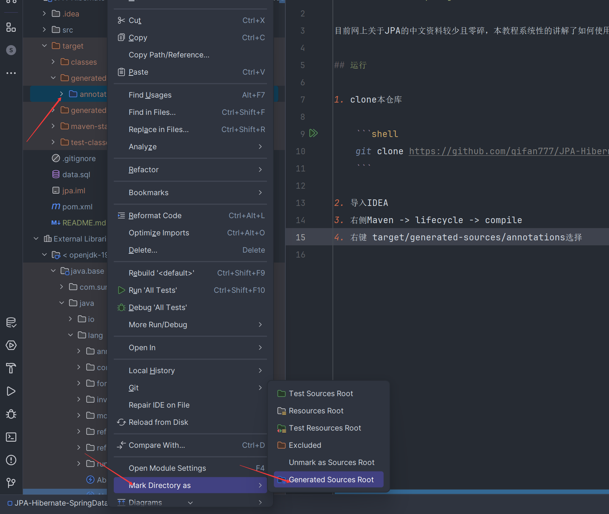

# JPA-Hibernate-SpringDataJPA

目前网上关于JPA的中文资料较少且零碎，本教程系统性的讲解了如何使用JPA建模，查询，criteria动态SQL，数据抓取。

## 运行

1. clone本仓库

    ```shell
    git clone https://github.com/qifan777/JPA-Hibernate-SpringDataJPA
    ```

2. 导入IDEA
3. 右侧Maven -> lifecycle -> compile
4. 右键 target/generated-sources/annotations选择 Mark directory as -> Generated Sources Root


    